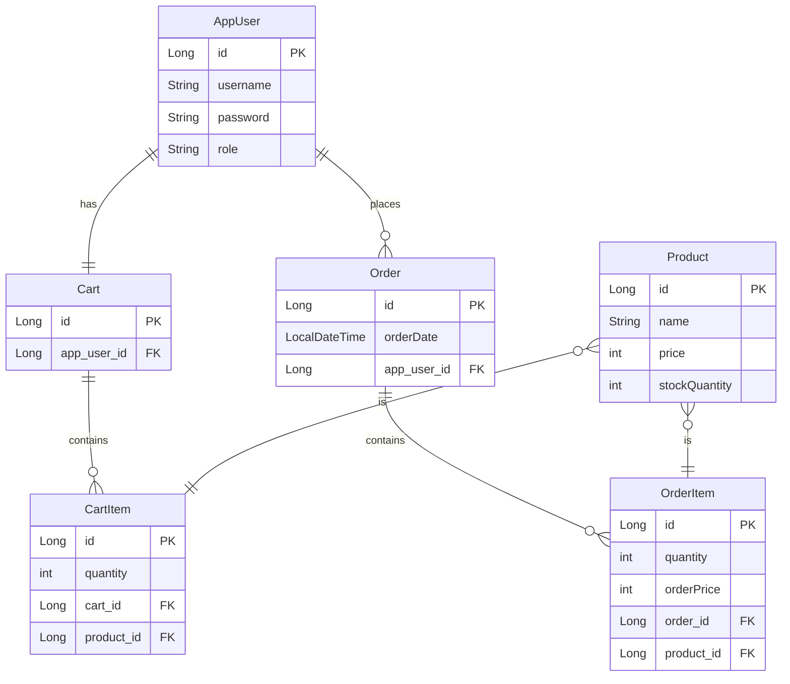

# ☕ Spring Boot E-Commerce Practice

간단한 전자상거래 시스템을 구현하고, 다음과 같은 핵심 기술 및 설계 패턴을 학습하는 것을 목표로 합니다.

* **엔티티 간의 연관관계 매핑 (Association Mapping)** 심층 학습
* **RESTful API 설계 및 구현** 능력 향상
* **JWT(JSON Web Token) 기반 인증/인가** 및 **Spring Security**를 활용한 접근 제어 구현

---

## ✨ 주요 기능

### 사용자 관리
- **회원가입** 및 **로그인** (JWT 기반 인증)
- 사용자 역할에 따른 접근 제어 ( `USER`, `ADMIN` )

### 상품 관리
- **상품 등록 및 삭제** ( `ADMIN` 권한 필요)
- **상품 정보 수정** (이름, 가격, 재고 등)
- **상품 목록 및 상세 정보 조회**

### 주문 관리
- **상품 주문** 생성
- **주문 내역 목록 조회** (본인 주문)
- **주문 상세 정보 조회**
- **주문 삭제**

 ---
## 🎨 데이터베이스 모델링 (ERM)

프로젝트의 데이터 구조는 다음과 같이 설계되었습니다. 

`Member` (사용자), `Product` (상품), `Order` (주문), `OrderItem` (주문 상품), `Cart` (카트), `CartItem` (카트 상품)

 ---
## 🛠️ 기술 스택

- **Backend**: `Java 21`, `Spring Boot 3.x`, `Spring Security`, `Spring Data JPA (Hibernate)`
- **Database**: `MariaDB`
- **API-Docs**: `SpringDoc (Swagger-UI)`
- **Etc**: `Lombok`, `JWT`

 ---
