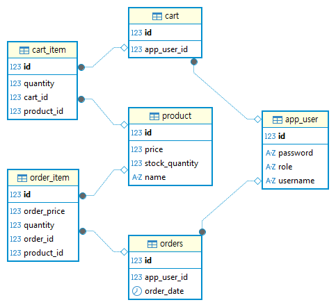

# ☕ Spring Boot E-Commerce Practice

여러 테이블 간의 연관관계 매핑과 RESTful API 설계를 학습하는 것을 목표로 합니다.

---

## ✨ 주요 기능

### 사용자 관리
- **회원가입** 및 **로그인** (JWT 기반 인증)
- 사용자 역할에 따른 접근 제어 ( `USER`, `ADMIN` )

### 상품 관리
- **상품 등록 및 삭제** ( `ADMIN` 권한 필요)
- **상품 정보 수정** (이름, 가격, 재고 등)
- **상품 목록 및 상세 정보 조회**

### 주문 관리
- **상품 주문** 생성
- **주문 내역 목록 조회** (본인 주문)
- **주문 상세 정보 조회**
- **주문 삭제**

 ---
## 🎨 데이터베이스 ERM

 ---
## 🛠️ 기술 스택

- **Backend**: `Java 21`, `Spring Boot 3.x`, `Spring Security`, `Spring Data JPA (Hibernate)`
- **Database**: `MariaDB`
- **API-Docs**: `SpringDoc (Swagger-UI)`
- **Etc**: `Lombok`, `JWT`

 ---